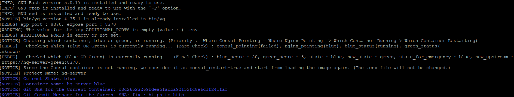
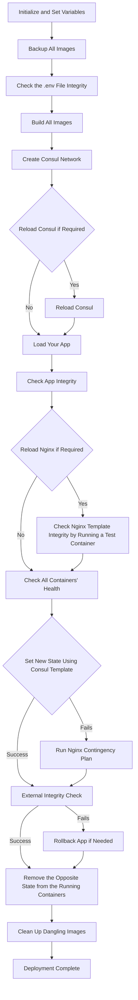
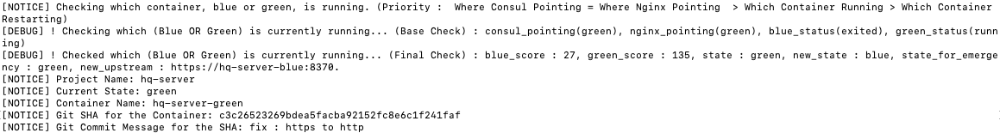

# Docker-Blue-Green-Runner

> A Simple and Safe Blue-Green Deployment Starting from Your Source Code—Not from Your Prebuilt Docker Image

## Table of Contents
- [Features](#features)
- [Process Summary](#process-summary)
- [Requirements](#requirements)
- [Quick Start with Samples](#quick-start-with-samples)
  - [Provided Samples](#provided-samples)
  - [How to Start with a React Guide](#how-to-start-with-a-react-guide)
  - [How to Start with a Node Sample](#how-to-start-with-a-node-sample)
  - [How to Start with a PHP Sample (HTTPS self-signed SSL)](#how-to-start-with-a-php-sample-https-self-signed-ssl)
  - [How to Start with a PHP Sample](#how-to-start-with-a-php-sample)
  - [How to Start with a Java Spring-Boot Sample](#how-to-start-with-a-java-spring-boot-sample)
  - [How to Start with a Java Spring-Boot Sample (HTTPS commercial SSL)](#how-to-start-with-a-java-spring-boot-sample-https-commercial-ssl)
- [Quick Guide on Usage](#quick-guide-on-usage)
  - [Information on Environment Variables](#information-on-environment-variables)
    - [APP_URL](#app_url)
    - [Important ENVs That Require Restarting NGINX](#important-envs-that-require-restarting-nginx)
  - [Upgrade](#upgrade)
  - [Fully Customizing NGINX Configuration](#fully-customizing-nginx-configuration)
  - [NGINX Contingency Function](#nginx-contingency-function)
  - [Terms](#terms)
  - [Log Levels](#log-levels)
  - [Check States](#check-states)
  - [Emergency](#emergency)
  - [Security](#Security)
  - [Running & Stopping Multiple Projects](#running--stopping-multiple-projects)
  - [Consul](#consul)
  - [USE_NGINX_RESTRICTION on .env](#use_nginx_restriction-on-env)
  - [Advanced](#advanced)
- [Production Deployment](#production-deployment)
  - [Upload Image (CI/CD Server -> Git)](#upload-image-cicd-server---git)
  - [Download Image (Git -> Production Server)](#download-image-git---production-server)
- [Extra Information](#extra-information)
  - [Test](#test)
  - [Check Source Integrity of 'Docker-Blue-Green-Runner'](#check-source-integrity-of-docker-blue-green-runner)
  - [Structure](#structure)
  - [Concurrent Running for this App](#concurrent-running-for-this-app)
  - [Docker Swarm](#docker-swarm)

---

## Features

1. **Achieve zero-downtime deployment using just your ``.env`` and ``Dockerfile``**
   - Docker-Blue-Green-Runner's `run.sh` script is designed to simplify deployment: "With your `.env`, project, and a single Dockerfile, simply run 'bash run.sh'." This script covers the entire process from Dockerfile build to server deployment from scratch.
   - This means you can easily migrate to another server with just the files mentioned above.
   - In contrast, Traefik requires the creation and gradual adjustment of various configuration files, which requires your App's docker binary running.


2. **No unpredictable errors in reverse proxy and deployment : Implement safety measures to handle errors caused by your app or Nginx**
   - If any error occurs in the app or router, ``deployment is halted`` to prevent any impact on the existing deployment
     - Internal Integrity Check:
       - Step 1: Use wait-for-it.sh (https://github.com/vishnubob/wait-for-it)
       - Step 2: Perform a health check with customized settings defined in your .env file
     - Nginx Router Test Container
     - External Integrity Check
     - Nginx Contingency Plan
     - Rollback Procedures
     - Additional Know-hows on Docker: Tips and best practices for optimizing your Docker workflow and deployment processes
   - For example, Traefik offers powerful dynamic configuration and service discovery; however, certain errors, such as a failure to detect containers (due to issues like unrecognized certificates), can lead to frustrating 404 errors that are hard to trace through logs alone.
     - https://stackoverflow.com/questions/76660749/traefik-404-page-not-found-when-use-https
     - https://community.traefik.io/t/getting-bad-gateway-404-page-when-supposed-to-route-to-container-port-8443/20398
   - Manipulates NGINX configuration files directly to ensure container accessibility. It also tests configuration files by launching a test NGINX Docker instance, and if an NGINX config update via Consul-Template fails, Contingency Plan provided is activated to ensure connectivity to your containers.


3. **Track Blue-Green status and the Git SHA of your running container for easy monitoring.**
   - Blue-Green deployment decision algorithm: scoring-based approach
   - Run the command bash ``check-current-status.sh`` (similar to ``git status``) to view all relevant details
   -
   -
     


4. **Security**
   - Refer to the [Security](#Security) section


5. **Production Deployment**
   - Refer to the [Production Deployment](#production-deployment) section
   
## Process Summary

- Term Reference
  - ``All`` means below is "App", "Nginx", "Consul&Registrator".
  - ``(Re)Load`` means ``docker run.... OR docker-compose up``.
  - ``State`` is ``Blue`` or ``Green``
  - More is on [Terms](#terms)
- Load Consul & Registrator, then the App, and finally Nginx to prevent upstream errors.






## Requirements

### OS

- Linux based OS such as Ubuntu, CentOS, WIN WSL and MacOS
  - If you are using WSL2 in WIN10 (not WIN11), which has the CRLF issue, you should run `bash prevent-crlf.sh` twice, and then execute the required `.sh` file.
    - The error message you might encounter is `$'\r': command not found`.
  - When using WSL2, I recommend cloning the project into the WSL area (`\\wsl$\Ubuntu\home`) instead of `C:\`.
  - Available on MacOS as long as GNU-based libraries are installed. See the 'Dependencies' section for more details.

  
### Application Requirements

- The image or Dockerfile in your application should include the `bash` and `curl` commands, as demonstrated in the `./samples/spring-sample-h-auth` folder as an example.
  

### Permissions and File Structure

- You can run your project with `bash run.sh`, but if you encounter any permission issues, run `sudo bash run.sh`.
- Although the sample folders are included in this project, it is recommended that you place your own projects in external directories and always use absolute paths.


### Docker Considerations

- **No Container in Container**:
  - Do not use Docker-Blue-Green-Runner inside containers, such as those provided by CircleCI or Dockerized Jenkins. These builders run within their own container environments, making it difficult for Docker-Blue-Green-Runner to utilize volumes.
  - This issue is highlighted in the [CircleCI discussion on 'docker-in-docker-not-mounting-volumes'](https://discuss.circleci.com/t/docker-in-docker-not-mounting-volumes/14037/3).


## Dependencies

| Library Name                          | Required Version | Auto Installation | Additional Considerations                                                                                                      |
|---------------------------------------|------------------|-------------------|--------------------------------------------------------------------------------------------------------------------------------|
| git                                   | N/A              | Manual            | -                                                                                                                              |
| bash                                  | 4.4 at least     | Manual            | -                                                                                                                              |
| curl                                  | N/A              | Manual            | -                                                                                                                              |
| yq                                    | 4.35.1           | Auto              | Use v4.35.1 instead of the latest version. The lastest version causes a parsing error                                          |
| consul (docker image)                 | 1.14.11          | Auto              | An error occurred due to a payload format issue while the lastest version of it was communicating with gliderlabs/registrator. |
| gliderlabs/registrator (docker image) | master           | Auto              |                                                                                                                                |
| nginx (docker image)                  | 1.25.4           | Auto              | Considering changing it to a certain version, but until now no issues have been detected.                                      |
| docker                                | 24~27            | Manual            | I think too old versions could cause problems, and the lastest version v27.x causes only a warning message.                    |
| docker-compose                        | 2                | Manual            | I think too old versions could cause problems, and the v2 is recommended.                                                      |

- Although issues with wrong versions of these libraries can cause errors, there are several safety mechanisms in place to prevent the server from being interrupted. For example, when you run run.sh, early on it checks: 1) the existence of the required libraries, 2) the NGINX Contingency Function section below, and 3) in case of restarting Nginx (NGINX_RESTART=true in .env), a preliminary check for integrity (check_nginx_templates_integrity in use-nginx.sh).
- For ``docker-compose``, if you use a version above v2.25.0, you will see a warning message: ``[WARN] The attribute 'version' is obsolete and will be ignored. Please remove it to avoid potential confusion``. You can ignore it at this point.
- For MAC users, ``GNU-based bash, sed, grep`` should be installed.
- For MAC users, ``SHARED_VOLUME_GROUP_*`` on .env are skipped.

## Quick Start with Samples

### Provided Samples
|         | O/X |
|---------|-----|
| Node.js | O   |
| PHP     | O   |
| Java    | O   |
| React   | O   |

### How to Start with a React Guide
[Link : Deploy your static React project](documents/Deploy-React-Project-with-DBGR.md)

### How to Start with a Node Sample
- Check the port number 13000 available before getting this started.

A Node.js sample project (https://github.com/hagopj13/node-express-boilerplate) comes with an MIT License and serves as an example for demonstrating how to use Docker-Blue-Green-Runner.

```shell
# First, since the sample project requires MongoDB, run it separately. This is only for DB UP, no docker-compose.yml required for your project.
cd samples/node-express-boilerplate
docker-compose build
docker-compose up -d mongodb
# Second, if 'host.docker.internal' is not available, change 'MONGODB_URL' in ./samples/node-express-boilerplate/.env to your host IP.
```

```shell
# Return to the ROOT directory.
cd ../../
# Copy the local environment settings to the main .env file.
cp -f .env.example.node .env
# If 'host.docker.internal' is not available, change 'host.docker.internal' in the ./.env file to your host IP.
# If you would like the exposed port to be 80, correct two properties in .env to be the following.
## APP_URL=http://localhost:80
## PROJECT_PORT=[80,3000]

# NOTE: The Health Check stage may take longer initially as the "node_modules" are not installed in the sample project.
sudo bash run.sh

```


### How to Start with a PHP Sample (HTTPS self-signed SSL)
- Check the port number 8081 available before getting this started.

A PHP sample project (https://github.com/Andrew-Kang-G/laravel-crud-boilerplate) that comes with an MIT License and serves as an example for demonstrating how to use Docker-Blue-Green-Runner.

```shell
# First, as the sample project requires MariaDB, run it separately.
cd samples/laravel-crud-boilerplate
docker-compose build
docker-compose up -d 
```

```shell
# Go back to the root
cd ../../
cp -f .env.example.php .env
# For WIN 10 WSL2, \r on shell scripts can cause issues.
chmod +x samples/laravel-crud-boilerplate/.docker/sh/update/run.sh
sed -i -e 's/\r$//' samples/laravel-crud-boilerplate/.docker/sh/update/run.sh

# [NOTE] Initially, since the sample project does not have the "vendor" installed, the Health Check stage may take longer.
sudo bash run.sh
```
Open https://localhost:8081 (NO http. see .env. if you'd like http, change APP_URL) in your browser, and test with the Postman samples (./samples/laravel-crud-boilerplate/reference/postman) and debug with the following instruction ( https://github.com/Andrew-Kang-G/laravel-crud-boilerplate#debugging ).


### How to Start with a Java Spring-Boot Sample
```shell
# First, as the sample project requires MySQL8, run it separately.
# You can use your own MySQL8 Docker or just clone "https://github.com/patternhelloworld/docker-mysql-8"
```

```shell
# In the ROOT folder,
cp -f .env.example.java .env

# For WIN 10 WSL2, \r on shell scripts can cause issues.
sed -i -e 's/\r$//' samples/spring-sample-h-auth/.docker/entrypoint/run-app.sh

sudo bash run.sh
```

## Quick Guide on Usage

### Information on Environment Variables

#### ``APP_URL``
- ```shell
  APP_URL=http://localhost:<--!host-port-number!-->
  PROJECT_PORT=<--!common-port-number!--> OR 
  PROJECT_PORT=[<--!host-port-number!-->,<--!internal-project-port-number!-->]
  ```
  - Additionally, the `APP_URL` parameter is used for the ["External Integrity Check"](#process-summary) process.
  - You can set it as https://localhost:13000 or https://your-domain:13000 for production environments. (Both configurations are acceptable)
  - Moreover, the Runner parses the protocol (http or https), and if it is https, it checks for SSL certificates in the .docker/ssl directory on the host according to the following settings:
  - ```shell
    USE_COMMERCIAL_SSL=true
    COMMERCIAL_SSL_NAME=yourssl
    ```
  - In case USE_COMMERCIAL_SSL is 'false', the Runner generates self-signed SSL certificates. However, you should set any name for ``COMMERCIAL_SSL_NAME``.

```shell

# This path is used for both internal and external health checks.
# Note: Do not include a leading slash ("/") at the start of the path.
# Example: "api/v1/health" (correct), "/api/v1/health" (incorrect)
APP_HEALTH_CHECK_PATH=api/v1/health

# The BAD & GOOD conditions are checked using an "AND" condition.
# To ignore the "BAD_APP_HEALTH_CHECK_PATTERN", set it to a non-existing value (e.g., "###lsdladc").
BAD_APP_HEALTH_CHECK_PATTERN=DOWN

# Pattern required for a successful health check.
GOOD_APP_HEALTH_CHECK_PATTERN=UP


DOCKER_COMPOSE_SELECTIVE_VOLUMES=["/my-host/files/:/in-container/files", "/my-host/java-spring-project/src/main/resources:/in-container/java-spring-project/src/main/resources"]
# Check if the host folder or file exists
DOCKER_COMPOSE_HOST_VOLUME_CHECK=false
# If APP_ENV is set to 'local', as specified in 'docker-compose-app-original.yml', synchronize your entire project as follows: "HOST_ROOT_LOCATION:PROJECT_LOCATION".
# [IMPORTANT] If this is set to true, Nginx will be restarted, resulting in a short downtime. 
# This option should be used when upgrading the Runner. See the "Upgrade" section below.
NGINX_RESTART=false

# Setting this to 'true' is not recommended for normal operation as it results in prolonged downtime.
CONSUL_RESTART=false

# Specify the location of the .git folder for your project here to enable tracking through container labels.
# To track, simply run `bash check-current_states.sh`.
DOCKER_BUILD_SHA_INSERT_GIT_ROOT=

# Not recommended for normal operation as it leads to a long downtime.
# If this is set to true, it entails running 'stop-all-containers.sh & remove-all-images.sh'.
# In case your project is renamed or moved to another folder, Docker may not work properly.
DOCKER_LAYER_CORRUPTION_RECOVERY=false

# The value should be in JSON format, which is injected into docker-compose-app.yml
DOCKER_COMPOSE_ENVIRONMENT={"MONGODB_URL":"mongodb://host.docker.internal:27017/node-boilerplate","NODE_ENV":"development"}

# [IMPORTANT] If you set this to 'true', you won't need to configure SSL for your app. For instance, in a Spring Boot project, you won't have to create a ".jks" file. However, in rare situations, such as when it's crucial to secure all communication lines with SSL or when converting HTTPS to HTTP causes 'curl' errors, you might need to set it to 'false'.If you set this to 'true', you don't need to set SSL on your App like for example, for a Spring Boot project, you won't need to create the ".jks" file. However, in rare cases, such as ensuring all communication lines are SSL-protected, or when HTTPS to HTTP causes 'curl' errors, you might need to set it to 'false'.
# 1) true : [Request]--> https (external network) -->Nginx--> http (internal network) --> App
# 2) false :[Request]--> https (external network) -->Nginx--> https (internal network) --> App
REDIRECT_HTTPS_TO_HTTP=true
```
#### [IMPORTANT] ENVs that require restarting NGINX.
##### Set 'NGINX_RESTART=true', otherwise changes will not be reflected.
```shell
APP_URL
PROJECT_PORT
ADDITIONAL_PORT
CONSUL_KEY_VALUE
USE_COMMERCIAL_SSL
COMMERCIAL_SSL_NAME
DOCKER_COMPOSE_NGINX_SELECTIVE_VOLUMES
NGINX_CLIENT_MAX_BODY_SIZE
USE_MY_OWN_APP_YML
USE_NGINX_RESTRICTED_LOCATION
NGINX_RESTRICTED_LOCATION
REDIRECT_HTTPS_TO_HTTP
NGINX_LOGROTATE_FILE_NUMBER
NGINX_LOGROTATE_FILE_SIZE
SHARED_VOLUME_GROUP_ID # The application to the host does NOT depend on NGINX_RESTART=true. It is always applied.
SHARED_VOLUME_GROUP_NAME # The application to the host does NOT depend on NGINX_RESTART=true. It is always applied.
UIDS_BELONGING_TO_SHARED_VOLUME_GROUP_ID # The application to the host does NOT depend on NGINX_RESTART=true. It is always applied.
USE_MY_OWN_NGINX_ORIGIN
```

### Upgrade
- When you use any upgraded version of 'docker-blue-green-runner', set ```NGINX_RESTART=true``` on your .env,
- Otherwise, your server will load the previously built Nginx Image and can cause errors.
- then, just one time, run
```shell
git pull origin main
# set NGINX_RESTART=true on your .env, after that,
sudo bash run.sh
```
- However, as you are aware, ```NGINX_RESTART=true``` causes a short downtime. **Make sure ```NGINX_RESTART=false``` at all times**.

### Fully Customizing NGINX Configuration


- The ``origin`` folder is where you can modify original Nginx conf files.
- Create the five yellow-highlighted files ending with 'ctmpl.origin.customized' by copying the originals ending with 'ctmpl.origin.'
- You don't have to create all five files; just create the ones you need.
- In the .env file, set this to 'true'
```shell
USE_MY_OWN_NGINX_ORIGIN=true
# See '[IMPORTANT] ENVs that require 'NGINX_RESTART=true' above.
NGINX_RESTART=true
```
- For reference, the files you just created are ignored by git, so there won't be any issues when you run the following:
```shell
# Check if the source codes of Runner is manipulated.
bash check-source-integrity.sh
```
- Then, run ``(sudo) bash run.sh``. **Starting from v5.0.0**, if NGINX_RESTART is set to 'true', the Runner will test your configuration using ``nginx -t`` in a temporary container before recreating the NGINX container. If the test fails, the process stops, preventing any side effects on your currently running app.
- Don't touch any file in ``.docker/nginx/template``. They are just ones in ready to be injected into the NGINX Image in Dockerfile.
- Process of NGINX Configuration
  - ``Origin`` -(processed with the .env)-> ``Template`` -(docker build)-> ``Docker Image`` -(running entrypoint.sh)-> ``Docker Container``
- NGINX Logrotate 
  - ``.docker/nginx/origin/logroate/nginx``
- ENV Spel 
  - A syntax that brings values from the .env file throughout the ecosystem.
  - ``!#{ value here }`` 


### NGINX Contingency Function
- In the event of a Consul failure, the NGINX Contingency module takes over and operates NGINX autonomously. This ensures uninterrupted service by allowing NGINX to function independently.

### Terms
For all echo messages or properties .env, the following terms indicate...
- BUILD (=LOAD IMAGE) : ```docker build```
- UP (=LOAD CONTAINER) : ```docker-compose up```
- DOWN : ```docker-compose down```
- RESTART : Parse related-files if exists, and then run ```docker build & docker-compose down & docker-compose up ```
  - ex) NGINX_RESTART on .env means docker build & down & up for NGINX
- safe : set a new state(=blue or green) safely without halting the running server. (=zero-downtime)

### Log Levels
- ``DEBUG``: Simply indicates that a specific function has been executed or a certain part of the source code has been run.
- ``NOTICE``, ``WARN``: Just for your information.
- ``ERROR``: Although the current deployment has not been halted, there is a clear error.
- ``EMERGENCY``: A level of risk that halts the current deployment.

### Check States
- Run the following command.
```shell
bash check-current-states.sh
# The output example
[DEBUG] ! Checking which (Blue OR Green) is currently running... (Base Check) : consul_pointing(blue), nginx_pointing(blue}), blue_status(running), green_status(exited)
[DEBUG] ! Checked which (Blue OR Green) is currently running... (Final Check) : blue_score : 130, green_score : 27, state : blue, new_state : green, state_for_emergency : blue, new_upstream : https://PROJECT_NAME:8300.
```
- The higher the score a state receives, the more likely it is to be the currently running state. So the updated App should be deployed as the non-occupied state(new_state).
  
- 

### Emergency
- Nginx (like when Nginx is NOT booted OR 502 error...)
```shell
# emergency-nginx-down-and-up.sh : Stop & Run -> Activate
# emergency-nginx-restart.sh : Parse -> Build -> Stop & Run -> Activate

# Automatically set the safe state & down and up Nginx
bash emergency-nginx-down-and-up.sh

# In case you need to manually set the Nginx to point to 'blue' or 'green'
bash emergency-nginx-down-and-up.sh blue
## OR
bash emergency-nginx-down-and-up.sh green

# If the script above fails, recreate & reset all about Nginx settings.
bash emergency-nginx-restart.sh

# If the script above fails, set *NGINX_RESTART to be true on .env. and..
sudo bash run.sh

# This fully restarts the whole system.
bash stop-all-containers.sh && bash remove-all-images.sh && bash run.sh

# Ways to check logs
docker logs -f ${project_name}-nginx   # e.g. node-express-boilerplate-nginx
# Ways to check Nginx error logs
docker exec -it ${project_name}-nginx bash # now you're in the container. Check '/var/log/error.log'
```
- Rollback your App to the previous App
```shell
# Roll-back only your App to the previous image.
bash ./rollback.sh

# The Nginx Container is roll-backed as well. (Not recommended. Nginx is safely managed as long as you use released versions.)
bash ./rollback.sh 1
```
- Critical Error on the Consul Network
  - This rarely happens when...
    - The server machine has been restarted, and affects the Consul network.
    - You change the ```ORCHESTRATION_TYPE``` on the .env, the two types (compose,stack) for it come to use different network scopes, which leads to a collision.
```shell
bash emergency-consul-down-and-up.sh
```

### Security
- In Linux, security begins with file permissions. To ensure that unauthorized users cannot access volume folders while allowing specific users on the host to access them, the following `.env` settings have been added:
```shell
# You can find the implementation of the following on "How to Start with a PHP Sample (HTTPS self-signed SSL)"
DOCKER_BUILD_ARGS={...,"shared_volume_group_id":"1351","shared_volume_group_name":"laravel-shared-volume-group"}

SHARED_VOLUME_GROUP_ID=1351
SHARED_VOLUME_GROUP_NAME=laravel-shared-volume-group
UIDS_BELONGING_TO_SHARED_VOLUME_GROUP_ID=1000
```
  - The Runner's host applies secure file modes to 1) scripts and support files, and 2) shared folders by running the following...
```shell
sudo bash apply-security.sh
```
- Since your custom settings are managed in .gitignore, the following script allows you to check if you accidentally touched other parts of the source code.
```shell
bash check-source-integrity.sh
```

### Running & Stopping Multiple Projects
- Store your .env as ```.env.ready.*``` (for me, like ```.env.ready.client```, ```.env.ready.server```)
- When deploying ```.env.ready.client```, simply run ```cp -f .env.ready.client .env```
- ```bash run.sh```
- If you wish to terminate the project, which should be on your .env, run ```bash stop-all-containers.sh```
- If you wish to remove the project's images, which should be on your .env, run ```bash remove-all-images.sh```

### Consul
`` http://localhost:8500 ``
- Need to set a firewall for the 8500 port referring to ``./docker-orchestration-consul.yml``.

### USE_NGINX_RESTRICTION on .env
- https://docs.nginx.com/nginx/admin-guide/security-controls/configuring-http-basic-authentication
- Create ```.htpasswd``` on ```./.docker/nginx/custom-files``` if you would like use the settings. This is useful when you apply security to API Doc Modules such as Spring-Rest-Docs.

### Advanced
- Customizing ```docker-compose.yml```
  - Docker-Blue-Green-Runner uses your App's only ```Dockerfile```, NOT ```docker-compose```.
  - You can set 'DOCKER_COMPOSE_ENVIRONMENT' on .env to change environments when your container is up.
  - **However, in case you need more to set, follow this step.**
    - ```cp -f docker-compose-app-original.yml docker-compose-${project_name}-original-ready.yml```
    - Add variables you would like to ```docker-compose-${project_name}-original-ready.yml```
    - **For the properties of 'environment, volumes', use .env instead of setting them on the yml.**
    - Set ```USE_MY_OWN_APP_YML=true``` on .env
    - ```bash run.sh```


## Production Deployment
- Up to this point, your app has been running in a Docker container through the ``bash.run.sh`` command, enabling continuous Blue-Green deployments. However, you may want to deploy the built Docker image independently to another environment, and you likely wouldn't want to leave unnecessary source code, except for the Docker images and configuration files, on the production server.
- It is recommended to automate this process using Jenkins.

### Upload Image (CI/CD Server -> Git)
  - If you run the ``push-to-git.sh`` command, it pushes the container image currently running on the test server to the ``Git Container Registry`` at the specified address.
  ```shell
  GIT_IMAGE_LOAD_FROM_HOST=mysite.com:5050
  GIT_IMAGE_LOAD_FROM_PATHNAME=my-group/my-project-name/what/you/want
  GIT_TOKEN_IMAGE_LOAD_FROM_USERNAME=aaa
  GIT_TOKEN_IMAGE_LOAD_FROM_PASSWORD=12345
  GIT_IMAGE_VERSION=1.0.0
  ```
  - ``Git Container Registry``
    - You can easily create your own Gitlab Docker with https://github.com/patternknife/docker-gitlab-ce-runner
    - ``GIT_TOKEN_IMAGE_LOAD_FROM_USERNAME, PASSWORD`` are registered on 'Project Access Tokens'.
    - ``docker login failed to verify certificate: x509: certificate signed by unknown authority`` Error
      - The error "failed to verify certificate: x509: certificate signed by unknown authority" typically occurs when the Docker client is unable to trust the SSL certificate presented by the Docker registry (in this case, your GitLab Docker registry).
      - Solution
        - Place your CA's root certificate (.crt file) in /usr/local/share/ca-certificates/ and run sudo update-ca-certificates.
      
### Download Image (Git -> Production Server)
- Your production server should have docker-blue-green-runner, .env, and run ``run.sh`` to deploy the built images above.
- The only difference is to set ``GIT_IMAGE_LOAD_FROM=registry`` instead of ``GIT_IMAGE_LOAD_FROM=build``.
- When ``GIT_IMAGE_LOAD_FROM`` is set to ``build``, docker-blue-green-runner ``builds your Dockerfile``. However, when it is set to ``registry``, the runner ``downloads your images from the Git Container registry``.

  ```shell
  GIT_IMAGE_LOAD_FROM=registry # This is important
  GIT_IMAGE_LOAD_FROM_HOST=mysite.com:5050
  GIT_IMAGE_LOAD_FROM_PATHNAME=my-group/my-project-name/what/you/want
  GIT_TOKEN_IMAGE_LOAD_FROM_USERNAME=foo
  GIT_TOKEN_IMAGE_LOAD_FROM_PASSWORD=bar
  GIT_IMAGE_VERSION=1.0.0
  ```


## Extra Information

### Test
- Currently, it is definitely insufficient, and I will continue to add more.
```shell
# Tests should be conducted in the folder
cd tests/spring-sample-h-auth
sudo bash run-and-kill-jar-and-state-is-restarting-or-running.sh
```

### Check Source Integrity of 'Docker-Blue-Green-Runner'
```shell
git status # If any changes are detected, the source code may be corrupted, or just run ``bash check-source-integrity.sh``.
```

### Structure

#### Use-[Module].sh
- Here, 'Use' is not related to Hooks commonly used in front-end frameworks like React. Instead, it is more similar to Traits in PHP."

### Concurrent Running for this App
- Running ```sudo bash *.sh``` concurrently for the **same** project at the same time, is NOT safe.
- Running ```sudo bash *.sh``` concurrently for **different** projects at the same time, is safe.

### Docker Swarm

- Beta version. which is supposed to be improved in v6.
- 'ORCHESTRATION_TYPE=stack' is currently experimental, keep 'ORCHESTRATION_TYPE=compose' as it is in the production stage.
  - However, you would test the docker swarm, run the command. It is currently tested for the Java sample.
    - ```shell
        docker swarm init
        sudo bash run.sh
      ``` 
---
